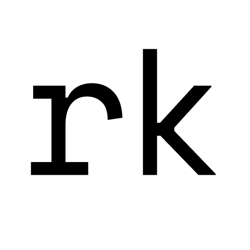

# UI Components Library

A library of UI components that I use in my apps.  
Made with React and styled-components, built with Rollup.

## Installation

```js
yarn add @robertkirsz/ui

// or

npm install @robertkirsz/ui
```

Make sure you have latest `react`, `react-dom` and `styled-components` installed as well.

## Usage

```js
import React from 'react'
import ReactDOM from 'react-dom'
import { ThemeProvider, Button } from '@robertkirsz/ui'

const App = () => (
  <Button primary size="small">
    Hello
  </Button>
)

ReactDOM.render(
  <ThemeProvider>
    <App />
  </ThemeProvider>,
  document.getElementById('root')
)
```

All available components with usage examples and their documentation can be found [here](https://robertkirsz.github.io/ui).

## Drak mode and custom themes

To use dark mode styles, wrap a particular part of your app with `<ThemeProvider>` and pass `darkMode` prop to it.

```js
<ThemeProvider darkMode>
  <PartsThatNeedToBeInDarkMode />
</ThemeProvider>
```

If you want to use a custom theme, you can pass your values as `theme` prop to `<ThemeProvider>`:

```js
const customTheme = {
  borderRadius: '0',
  colors: {
    text: 'red',
    primary: 'green',
    secondary: 'blue'
  }
}

<ThemeProvider theme={customTheme}>
  <PartsThatWillReceiveCustomTheme />
</ThemeProvider>
```

You can find the theme structure and values in [src/theme.ts](https://github.com/robertkirsz/ui/blob/main/src/theme.ts) file.

You can also `import { defaultTheme } from '@robertkirsz/ui'` and use it as a base for some more precise value-overwrites.

```js
import { defaultTheme } from '@robertkirsz/ui'

const customTheme = {
  colors: {
    ...defaultTheme.colors,
    secondary: 'yellow'
  }
}
```

## BasicStyles

You can `import { BasicStyles } from '@robertkirsz/ui'` and put it somewhere in your app to get some core styles and basic typography.

## Troubleshooting

If you don't see Intellisense suggestions for components' props in your editor, make sure you have `@types/react` and `@types/styled-components` installed as your devDependencies.

## Development

Make sure you're using Node version specified in `.nvmrc` file. If you have [nvm](https://github.com/nvm-sh/nvm) installed, you can do this:

```sh
nvm use
```

It will set the proper Node version for you (or prompt you to install it).

### Install dependencies

```sh
yarn install
```

### Start Storybook

```sh
yarn storybook
```

You can use it as a development environment as well as the showcase app for all components.  
It will be available at http://localhost:6006.

### Unit tests

```sh
yarn test
```

### Formatting code

```sh
yarn prettier
```


